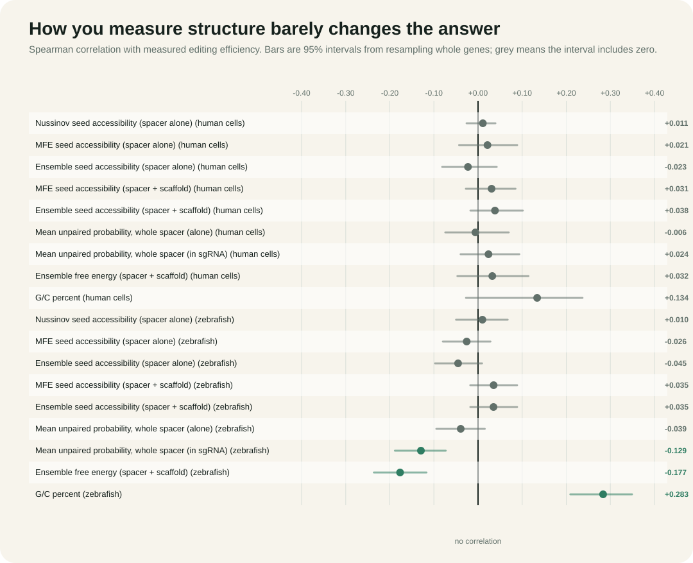
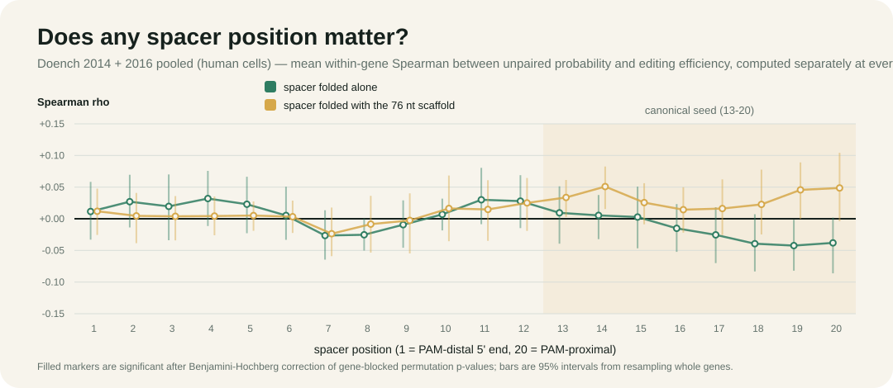
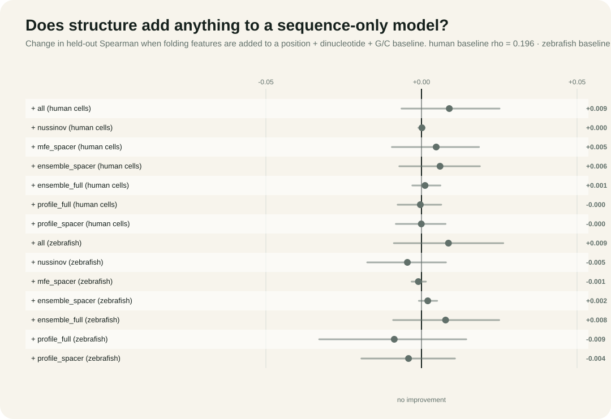

# RNA folding for CRISPR guide exploration

[](https://github.com/kwland/nussinov-zuker-crispr/actions/workflows/tests.yml)
[](https://www.python.org/)
[](LICENSE)

**Live interactive demo:** <https://kwland.github.io/nussinov-zuker-crispr/>

This project asks a simple biological question: if a CRISPR guide RNA folds back on itself, does that make its targeting sequence less available to bind DNA?

It is a reassessment rather than a first look. [WU-CRISPR](https://pmc.ncbi.nlm.nih.gov/articles/PMC4629399/) (Wong et al. 2015) built a guide-design tool on this premise and reported accessibility around **positions 18-20** as predictive. What has been thin is independent, well-controlled retesting.

Tested five ways across two independent screens and checked against ViennaRNA, the supported
conclusion is narrow, and it splits in two:

> **Predicted seed accessibility adds no measurable value for ranking ordinary SpCas9 guides in either screen.**
>
> **Overall predicted folding stability adds a small amount in zebrafish (about +0.04 with standard Turner parameters) and nothing in human cells, in the direction opposite to the accessibility hypothesis.**

That is not the same as saying RNA structure does not matter. Structure is known to be decisive
for particular refractory guides ([Riesenberg et al. 2022](https://www.nature.com/articles/s41467-022-28137-7)),
and a strong effect confined to a minority of guides is invisible in an average over thousands.


## The problem with the first answer

An early version of this project folded each 20 nt spacer on its own, took the single best structure, counted how many of the last 8 bases were unpaired, and correlated that with editing efficiency. The correlation was about 0.01, which is nothing.

That result had three obvious holes, and any reviewer would have found all of them:

1. **One structure is not the molecule.** RNA does not sit in a single conformation. Reading accessibility off one optimal structure gives every base a hard 0 or 1 that can flip on a tenth of a kcal/mol.
2. **A bare spacer is not the molecule either.** In a real sgRNA the spacer is followed by a 76 nt scaffold it can pair with.
3. **"The last 8 bases" was an assumption**, not something the data was asked about.

And even if all three were fixed, correlating one feature against activity is the wrong question. The question a guide designer cares about is whether structure adds anything to what sequence already tells you.

This repository closes all four.

## What was added

### 1. Ensemble accessibility, not single-structure accessibility

`mccaskill.py` implements the McCaskill (1990) partition function: the same O(n³) dynamic-programming family as Zuker, but with Boltzmann weights `exp(-E/RT)` instead of a minimum, plus the outside recursion that turns those into base-pair probabilities `p_ij`. Seed accessibility becomes the mean probability that each seed base is unpaired across the entire ensemble, which is what RNAplfold-style accessibility actually means.

The multiloop term in the outside pass is the awkward part. Written naively it is O(n⁴). The implementation factorises the enclosing-pair sum into two accumulator tables so the whole outside pass stays O(n³).

The implementation is verified rather than merely written. For sequences short enough to enumerate every pseudoknot-free structure, the partition function, every pair probability, and every unpaired probability match brute force to ~1e-15. Because the shipped parameters make multiloops carry under 0.1% of the ensemble weight, the tests also re-run the comparison with multiloops made artificially cheap, pushing them past 50% of the weight, and the recursions still match exactly. Stochastic Boltzmann sampling, which uses only the inside matrices, converges to the probabilities the outside pass computes independently.

The change of instrument is real: across 4,685 guides, single-structure seed accessibility takes only **9 distinct values** (it can only be a multiple of 1/8), while the ensemble measure takes **4,668**.



### 2. Folding in real molecular context

`guide_features.py` folds every spacer twice: alone, and joined to the 76 nt sgRNA scaffold. Both are reported side by side for all 5,705 guides.

That gap is not a detail. Mean seed accessibility falls from 0.84 folded alone to 0.42 folded in the sgRNA, and the two views correlate at only **r = 0.17**. Folding a spacer on its own tells you almost nothing about the molecule that actually exists. It also exposes a problem with the original hypothesis: a bare 20 nt spacer has an ensemble free energy of just −0.78 kcal/mol, and **22% of them are essentially unstructured**. There was barely any structure there to correlate with anything.

### 3. Position-resolved analysis

Per-base unpaired probabilities make it possible to correlate accessibility with efficiency at *every* spacer position rather than collapsing positions 13-20 into one number. Each correlation is computed within genes, each p-value comes from permuting activity inside genes, and Benjamini-Hochberg is applied across the 20 positions. This is the test that directly addresses the WU-CRISPR position 18-20 claim.



### 4. Incremental value, cross-validated and replicated

`run_study.py` builds a sequence-only baseline (position-specific bases, position-specific dinucleotides, G/C), evaluates it with **nested cross-validation that holds out whole genes**, then measures how much held-out Spearman changes when folding features are added. Confidence intervals come from resampling genes, not guides, because guides targeting the same gene are not independent.

Everything is then re-run on an independent screen: **CRISPRscan** (Moreno-Mateos et al. 2015): 1,020 guides, 111 genes, zebrafish embryos, in vivo, a different lab and a different readout.



### 5. Validated against ViennaRNA

The energy parameters here use published stacking values but simplified loop terms, so every
headline quantity is recomputed with **ViennaRNA 2.7.2** under standard Turner parameters
(`vienna_reference.py`, `validate_vienna.py`), at three temperatures and with local folding
as well as global. ViennaRNA is treated as the physical reference; the implementation in this
repository is the transparent, dependency-free, browser-runnable one.

Agreement on ensemble seed accessibility is r = 0.81, free energies carry a systematic
+4.4 kcal/mol offset, and **no accessibility-to-activity correlation shifts by more than
0.033** when the reference parameters are substituted. Ensemble measures agree between the
two implementations far better than single-structure ones (r = 0.81 against 0.57), which is
an argument for the ensemble measure independent of any biology.

## Findings

**Folding adds nothing in human cells, and a little in zebrafish, but only with a reference energy model.**

| | baseline ρ | + this project's features | + ViennaRNA features |
|---|---:|---:|---:|
| Doench (human cells) | 0.196 | +0.009 [−0.006, 0.025] | +0.002 [−0.004, 0.007] |
| CRISPRscan (zebrafish) | 0.387 | +0.009 [−0.009, 0.026] | **+0.040 [0.012, 0.072]** |

The human screen uses leave-one-gene-out over its 18 genes; the zebrafish screen uses grouped
five-fold repeated over three assignments. The zebrafish gain is stable across those
assignments (+0.032 to +0.046) and survives adjustment for G/C, but it is carried by **ensemble
free energy, not by seed accessibility**, and it points the opposite way to the hypothesis:
more stable folding accompanies higher activity. It does not transfer to human cells.

That the two energy models disagree here is the point of validating: the simplified loop terms
were hiding a real effect in one screen, and the validation found it.

**Accessibility does correlate, very faintly.** The sharpest measure, ensemble accessibility of
the seed in the intact sgRNA, reaches within-gene ρ = 0.069 [0.010, 0.130] in the human screen,
in the predicted direction, surviving adjustment for G/C. That is under half a percent of the
variance, and adding it to the baseline changes accuracy by +0.001 [−0.003, 0.006].

**The WU-CRISPR position 18-20 claim is not reproduced.** With gene-blocked permutation and
BH correction, **0 of 20** positions are significant in the human screen in either folding
context. In zebrafish 8 of 20 survive, but they sit at positions 3-13, the PAM-*distal* half,
which is the wrong end for a seed-occlusion mechanism.

**A correction worth reading.** An earlier version of this analysis reported a real +0.016 gain
in zebrafish with an interval excluding zero. It did not survive two fixes: choosing the ridge
penalty on the metric actually being reported, and repeating over several gene-to-fold
assignments. The spread across assignments (0.015) is larger than the effect that was claimed
(0.016). With few independent groups, one split can manufacture a finding of exactly the size
that gets published.

**An aside worth the price of admission.** G/C content, the classic guide-design rule,
correlates with Doench activity at pooled ρ = +0.134 but **−0.016** within genes. Its apparent
usefulness there is entirely a between-gene effect. A feature can look predictive pooled across
targets and carry no information for the choice a designer actually makes.

See [ANALYSIS.md](ANALYSIS.md) for the full account and [analysis_outputs/study_summary.md](analysis_outputs/study_summary.md) for every table.

## What is included

Folding:

- `nussinov.py`: Nussinov base-pair maximization, dependency-free.
- `energy_model.py`: nearest-neighbour free energies, plus an independent loop-by-loop structure energy evaluator and an exhaustive structure enumerator used for testing.
- `zuker.py`: minimum-free-energy folding.
- `mccaskill.py`: partition function, base-pair probabilities, Boltzmann sampling.

Analysis:

- `crispr_nussinov_analysis.py`: per-guide features under all three models (`--context sgrna` adds the scaffold).
- `guide_features.py`: spacer-alone and spacer-plus-scaffold feature extraction.
- `datasets.py`: loaders for both screens.
- `stats.py`: Spearman, ridge regression, grouped cross-validation, cluster bootstrap.
- `model_features.py`: the sequence baseline and structure feature blocks.
- `compute_features.py`: folds a whole screen in parallel and caches the result.
- `run_study.py`: the four experiments.
- `export_model.py`: fits the browser's efficiency model.
- `export_site_data.py`: reduces the study results to the file the website reads.

Everything above uses **only the Python standard library**.

The interactive site in `docs/` carries its own JavaScript implementations of all three
folding models, so the partition function runs live in the browser: the Analyzer reports
the probability that each spacer position is unpaired, alongside the single-structure
answer, and chapter 05 presents the four experiments below. The Python and JavaScript
folders agree to the last decimal on the same sequences.

## Installation

Python 3.10 or newer. No dependencies.

```bash
git clone https://github.com/kwland/nussinov-zuker-crispr.git
cd nussinov-zuker-crispr
python nussinov.py --sequence GGGAAACCC
```

An editable install adds the `rna-fold`, `crispr-guide-features`, `crispr-fold-screen`, and `crispr-run-study` commands:

```bash
python -m pip install -e .
```

## Reproduce everything with one command

```bash
python reproduce.py
```

That verifies the dataset checksums, runs the tests, folds both screens, runs the study,
rebuilds the website's data files, regenerates every figure, and (if ViennaRNA is
installed) produces the ViennaRNA reference and validation. `python reproduce.py --list`
prints the steps without running them; `--skip-folding` reuses the cached features;
`--quick` uses small resampling counts for a smoke test.

ViennaRNA is an optional validation dependency and often lives in a different
interpreter than the one running the project:

```bash
python reproduce.py --vienna-python /path/to/python-with-viennarna
```

## Reproduce a single step

Fold a few example guides under all three models:

```bash
python crispr_nussinov_analysis.py --input examples/guides.csv --output analysis_outputs/example_guide_features.csv
```

Add the scaffold. This is slower, because the molecule becomes 96 nt instead of 20:

```bash
python crispr_nussinov_analysis.py --input examples/guides.csv --context sgrna --output analysis_outputs/example_sgrna_features.csv
```

Reproduce the whole study from scratch. The folding step is the expensive one (about 8 minutes for both screens on 11 cores) and is cached, so the analysis can be re-run without re-folding:

```bash
python compute_features.py --dataset doench
python compute_features.py --dataset crisprscan
python run_study.py
python make_figures.py
```

Refit the model used by the website and rebuild its data file:

```bash
python export_model.py
python export_site_data.py
```

## Run the tests

```bash
python -m unittest discover -v
```

The suite covers three layers:

- **Folding correctness by brute force**: the partition function, every pair probability, and the MFE are checked against exhaustive enumeration of every pseudoknot-free structure on short sequences, including under stressed multiloop parameters. The Zuker folder reproduces the accepted yeast tRNA-Phe cloverleaf exactly.
- **Statistics**: ranking with ties, Benjamini-Hochberg monotonicity, permutation-test calibration under the null, Cholesky against known systems, and that grouped folds never split a gene.
- **The guard against fooling yourself**: nested cross-validation given pure noise must report no signal.

## How the three models differ

For an interval `(i, j)`:

- **Nussinov** stores the largest number of non-crossing pairs. Every allowed pair is worth +1. Transparent, but not physical: it over-pairs, and it cannot tell a stable helix from a weak one with the same pair count.
- **Zuker** stores the lowest free energy, using stacking, loop, and multiloop terms. One structure out.
- **McCaskill** stores the sum of `exp(-E/RT)` over all structures. Running the recursion outward as well as inward gives the probability of every pair, and hence of every base being unpaired.

The first two answer "what is the best structure?". Only the third answers "how often is this base free?", which is the question guide accessibility actually asks.

## Limitations

- **The energy parameters are partly simplified.** The ten Watson-Crick stacking values are the published Turner/Xia numbers. The G-U wobble terms, loop initiation tables, and multiloop model are documented approximations, and the measured cost is a systematic +4.4 kcal/mol offset in free energy, so absolute kcal/mol from this model are not thermodynamic values. Every approximation is flagged in `energy_model.py`, and `validate_vienna.py` quantifies the consequences. No conclusion depends on them.
- **Significance rests on gene-blocked permutation.** Guides within a gene are correlated, so a free shuffle is anti-conservative. The reported tests permute activity inside each gene. Earlier versions of this analysis did not, and their significance counts were wrong.
- **Only pseudoknot-free secondary structure is modelled.** Tertiary contacts, kinetics, co-transcriptional folding, and Cas9 protein binding are all outside it. Cas9 actively unwinds and reshapes the guide, which may be why in-solution accessibility predicts so little.
- **Guide activity is not structure.** Chromatin, target context, repair pathway, expression, off-target binding, and nuclease behaviour all contribute and none are modelled.
- **The pooled Doench labels come from two screens** normalised within each source. That helps comparison but does not make the experiments identical.
- **Only 18 genes in the main screen.** Holding out whole genes is the right thing to do, but it leaves few independent units, which is why the confidence intervals are wide.
- **Every CRISPRscan spacer starts with GG** because of the T7/SP6 promoter, so positions 1-2 carry no information in that screen.
- **The 3D view is schematic**, a layout of the predicted secondary structure rather than a molecular model.
- **The committed Python example guides are synthetic** and carry no measured activity.
- **Correlation is not causation**, and a null result is evidence of absence only within the range these screens actually cover.
- **This is about average ranking utility, not biology.** Predicted accessibility being a poor general-purpose scoring term is compatible with structure being decisive for individual guides.

## Repository layout

```text
.
├── nussinov.py                  energy_model.py    zuker.py      mccaskill.py
├── guide_features.py            datasets.py        stats.py      model_features.py
├── crispr_nussinov_analysis.py  compute_features.py
├── run_study.py                 export_model.py    make_figures.py
├── test_nussinov.py             test_mccaskill.py  test_study.py
├── data/
│   ├── crispr_guide_examples.csv
│   └── crisprscan_moreno_mateos_2015.csv
├── analysis_outputs/            cached features, study_results.json, study_summary.md
├── figures/                     generated SVGs
├── docs/                        the static interactive site
└── notes/
```

## Data sources

Every dataset is pinned to an exact URL and upstream commit, with SHA-256 checksums for
both the downloaded file and the converted copy. [data/DATA.md](data/DATA.md) is the
generated data dictionary, covering every column, the citation, and the licensing and
redistribution position for each source.

```bash
python fetch_data.py --verify   # check the committed data against its checksums
python fetch_data.py            # re-download and re-convert from the pinned commit
```

- **Doench 2014 + 2016** pooled through CRISPOR / Haeussler et al. (2016), in
  `docs/data/guides.json`. Ships with the repository because the website reads it.
- **CRISPRscan** (Moreno-Mateos et al. 2015) in `data/crisprscan_moreno_mateos_2015.csv`,
  downloaded from `maximilianh/crisporPaper` at commit `33a8225c` and reduced to five
  columns. `fetch_data.py` reproduces it byte for byte.

The ViennaRNA comparison values in the site's chapter 06 are output of the ViennaRNA
package. Every other folding result, accessibility value, energy, and model weight in
this repository is computed by the code in it.

Key references:

Algorithms and energy models:

- Nussinov & Jacobson (1980), *PNAS*: base-pair maximization.
- Zuker & Stiegler (1981), *Nucleic Acids Research*: minimum-free-energy folding.
- McCaskill (1990), *Biopolymers*: the partition function and base-pair probabilities.
- Ding & Lawrence (2003), *Nucleic Acids Research*: statistical sampling of RNA structures.
- Xia et al. (1998), *Biochemistry*: nearest-neighbour parameters.
- Lorenz et al. (2011), *Algorithms for Molecular Biology*: [ViennaRNA 2.0](https://www.tbi.univie.ac.at/RNA/).

Guide activity and the accessibility claim being reassessed:

- Wong, Liu & Wang (2015), *Genome Biology* 16:218: [WU-CRISPR](https://pmc.ncbi.nlm.nih.gov/articles/PMC4629399/), which reported accessibility at positions 18-20 as predictive. This project is an independent reassessment of that claim.
- Doench et al. (2016), *Nature Biotechnology*: Rule Set 2 guide activity.
- Moreno-Mateos et al. (2015), *Nature Methods*: CRISPRscan.
- Haeussler et al. (2016), *Genome Biology*: CRISPOR.
- Riesenberg et al. (2022), *Nature Communications* 13:489: [sgRNA misfolding in refractory guides](https://www.nature.com/articles/s41467-022-28137-7), the direct evidence that structure can matter decisively for individual guides even when it carries little average signal.

## Author

Linus Tan.

## License

MIT. See [LICENSE](LICENSE).

---

Built as an explainable research prototype: small enough to inspect, verified against brute force where that is possible, and honest about a negative result. Questions, corrections, and collaboration are welcome.
